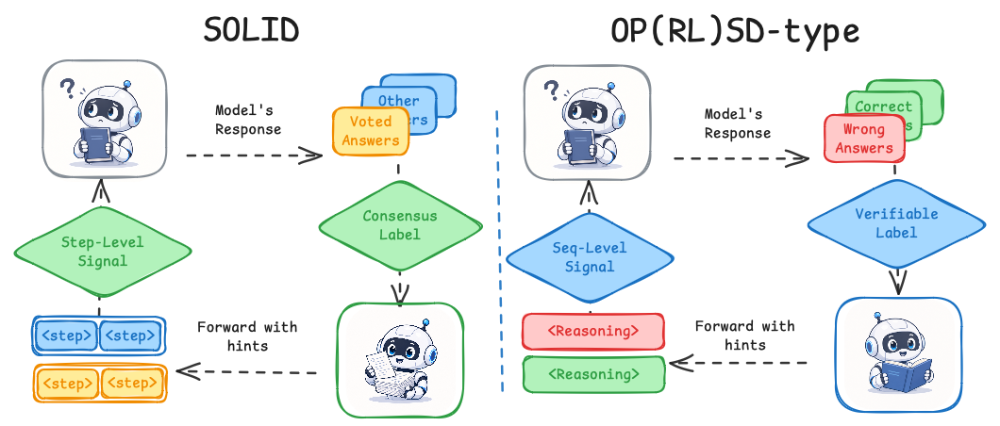
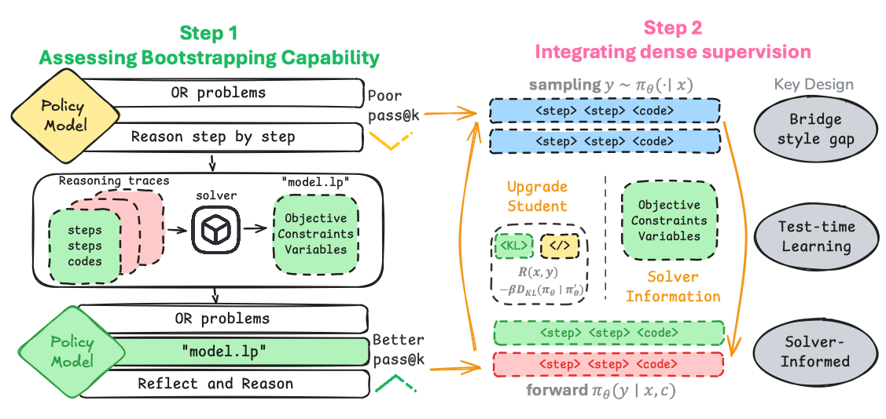
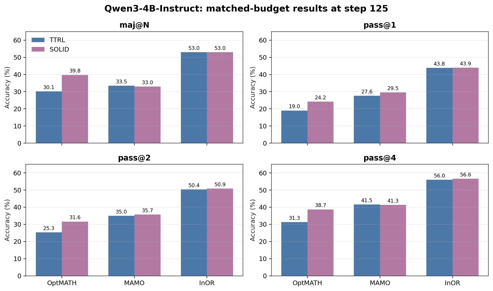
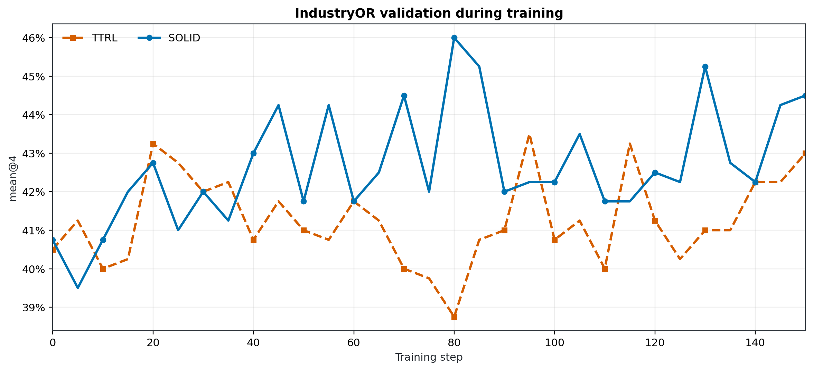

<div align="center">

# SOLID

### Beyond Verified Answers: Solver-Informed Self-Distillation for Bootstrapping Operations Research Language Models

[](https://www.python.org/)
[](LICENSE)
[](https://github.com/volcengine/verl)

**Label-free post-training for operations-research language models using solver execution, rollout consensus, and localized on-policy self-distillation.**



</div>

This repository contains the anonymized implementation of **SOLID**
(**S**olver-Informed **O**n-Policy **L**earn**I**ng through Self-**D**istillation).
SOLID learns from unlabeled OR prompts without verified answers, a reward model,
or an external judge. It executes sampled solver programs, turns objective
consensus into a pseudo-reference, and supplies token-level guidance only where
the candidate LP differs structurally from that reference.

The implementation follows the `verl/` package layout and keeps the original
import namespace for compatibility. The paper-to-code correspondence is in
[`docs/METHOD_TO_CODE.md`](docs/METHOD_TO_CODE.md).

## Highlights

- **No verified training labels:** sequence rewards come from executable
  solver-outcome consensus.
- **Dense but localized supervision:** reverse KL is applied only to
  non-majority responses and LP-mismatched variables, objectives, constraints,
  and code sections.
- **On-policy teacher:** the current policy is re-scored with privileged solver
  context and refreshed after every optimizer update.
- **Matched baseline:** `scripts/run_ttrl.sh` shares the rollout, reward, batch,
  and optimizer settings and disables only SOLID's self-distillation terms.
- **Reproducible release assets:** the plotted values are included as CSV files,
  and both README result figures can be regenerated locally.

## Method

For each rollout group, SOLID:

1. executes the generated solver programs;
2. normalizes objective direction and clusters finite objectives;
3. selects a majority-cluster LP artifact as the pseudo-reference;
4. assigns majority-membership rewards for GRPO;
5. compares candidate and reference LP structure for response sections 3, 4,
   5, and 9; and
6. applies same-policy reverse KL only to non-majority samples and structurally
   mismatched sections.

<p align="center">
  
</p>

## Results

The table below reports the matched-budget Qwen3-4B-Instruct comparison at
training step 125. All values are percentages; bold marks the best value for
each dataset and metric.

| Dataset | Method | maj@N | pass@1 | pass@2 | pass@4 |
| --- | --- | ---: | ---: | ---: | ---: |
| OptMATH | Base | 24.70 | 14.16 | 21.89 | 31.33 |
|  | TTRL | 30.12 | 19.01 | 25.29 | 31.32 |
|  | **SOLID** | **39.76** | **24.25** | **31.62** | **38.70** |
| MAMO-Complex | **Base** | **35.47** | 25.00 | 34.81 | **44.33** |
|  | TTRL | 33.50 | 27.56 | 34.95 | 41.52 |
|  | **SOLID** | 33.00 | **29.51** | **35.71** | 41.34 |
| InOR | Base | 52.00 | 41.56 | 48.84 | 55.11 |
|  | **TTRL** | **53.00** | 43.84 | 50.40 | 55.95 |
|  | **SOLID** | **53.00** | **43.92** | **50.85** | **56.64** |

Relative to matched-budget TTRL, SOLID improves 9 of 12 dataset-metric pairs
and ties one. The largest gains are on OptMATH: **+9.64 pp maj@N**, **+5.23 pp
pass@1**, **+6.33 pp pass@2**, and **+7.38 pp pass@4**. MAMO-Complex is the
main exception, where the base model retains the strongest majority accuracy
and pass@4.

<p align="center">
  
</p>

### Training dynamics

The curve reports IndustryOR validation mean@4. SOLID shows a clearer
late-training advantage over the outcome-only TTRL baseline, while both runs
use the same rollout and optimization budget.

<p align="center">
  
</p>

The source values are in [`assets/results`](assets/results). Regenerate both
README figures with:

```bash
python -m pip install -r requirements-plot.txt
python scripts/plot_readme_results.py
```

## Release completeness

| Component | Status | Location / note |
| --- | :---: | --- |
| Dependency specification | ✅ | `requirements*.txt` and `pyproject.toml` |
| Training code | ✅ | `scripts/run_solid.sh` and `scripts/run_ttrl.sh` |
| Evaluation hooks | ✅ | validation in the training loop; offline entry point in `verl/trainer/main_eval.py` |
| Result table and curves | ✅ | CSV sources and deterministic plotting script |
| Pretrained checkpoints | ⏳ | not included in this anonymous staging release |

Models, datasets, solver licenses, and checkpoints are intentionally not
committed. Their redistribution terms differ, and solver operation may require
a separate license.

## Installation

Python 3.10 or newer is required. We recommend a fresh virtual environment.

```bash
python -m venv .venv
source .venv/bin/activate
python -m pip install --upgrade pip
python -m pip install -r requirements.txt
python -m pip install -r requirements-gpu.txt
python -m pip install -e .
```

Install the solver backend used by your experiment:

```bash
python -m pip install -r requirements-solvers.txt
```

The launcher supports `gurobi` (default) and `copt`. Set `SOLVER_NAME` to
select one and configure its license outside this repository.

## Data

Training and validation data are passed as Hydra lists of Parquet files. Each
row follows the veRL RL dataset convention, including a chat-format `prompt`,
a `data_source` reward selector, and reward metadata. Dataset construction and
redistribution are benchmark-specific and are not bundled here.

```bash
export TRAIN_FILES='["/path/to/train.parquet"]'
export VAL_FILES='["/path/to/validation.parquet"]'
```

## Training

### SOLID

```bash
CUDA_VISIBLE_DEVICES=0,1,2,3 \
MODEL_PATH=/path/to/Qwen3-4B-Instruct \
TRAIN_FILES='["/path/to/train.parquet"]' \
VAL_FILES='["/path/to/validation.parquet"]' \
bash scripts/run_solid.sh
```

### TTRL baseline

Use the same model, data, and hardware variables:

```bash
CUDA_VISIBLE_DEVICES=0,1,2,3 \
MODEL_PATH=/path/to/Qwen3-4B-Instruct \
TRAIN_FILES='["/path/to/train.parquet"]' \
VAL_FILES='["/path/to/validation.parquet"]' \
bash scripts/run_ttrl.sh
```

Both launchers default to 24 rollouts per prompt, batch size 32, learning rate
`1e-6`, rollout temperature `1.0`, and four GPUs. The SOLID launcher adds a
reverse-KL coefficient of `1e-3`, LP-structured masking, and an on-policy
teacher refresh rate of `1.0`. See
[`docs/METHOD_TO_CODE.md`](docs/METHOD_TO_CODE.md) for the complete mapping.

Inspect the fully resolved command without starting a run:

```bash
MODEL_PATH=/path/to/model \
TRAIN_FILES='["/path/to/train.parquet"]' \
VAL_FILES='["/path/to/validation.parquet"]' \
bash scripts/run_solid.sh --dry-run
```

Run artifacts are written under `runs/<experiment-name>/` by default and are
ignored by Git.

## Repository structure

```text
.
├── assets/                 # README figures and their result CSV sources
├── docs/                   # method-to-code and anonymization notes
├── scripts/                # release audit, launchers, and plotting utility
├── training/               # common Hydra launcher
└── verl/
    ├── or_utils/           # solver execution, rewards, LP parsing
    ├── trainer/ppo/        # voting, masking, teacher prompts, PPO/GRPO logic
    └── ...                 # distributed veRL runtime
```

## Release audit

Before publishing or packaging the repository, run:

```bash
bash scripts/audit_release.sh
```

The audit checks for machine-specific paths, research identities, tracking
defaults, literal credentials, credential-like files, runtime artifacts, and
Python syntax errors. See [`docs/ANONYMIZATION.md`](docs/ANONYMIZATION.md) for
the full policy.

## Acknowledgements and license

This codebase is built on [veRL](https://github.com/volcengine/verl). Upstream
copyright and attribution notices are retained in the source tree.

The repository is released under the [Apache License 2.0](LICENSE). Citation
metadata and public checkpoint links will be added after the anonymous review
period.
